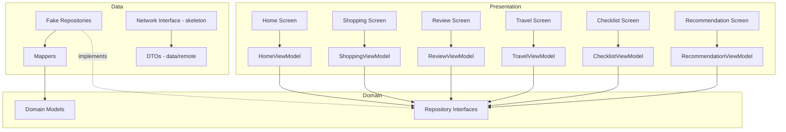

# Design Document: Android App Bootstrap (A0)

## Overview

Stage A0 establishes a buildable, navigable Android application skeleton that the entire team can iterate on during the hackathon (Aug 15–17). The app has six screens connected in a linear flow, uses fake repositories for offline operation, and enforces strict layer separation so the UI team can replace screens on Aug 17 without touching Domain or Data layers.



### Dependency Flow

```text
feature/ ──→ domain/ (models, repository interfaces)
                ↑
data/ ─────────┘ (implements domain interfaces, contains DTOs, mappers)
core/ ─── shared by all layers (config, logging, common)
```

No layer depends downward: feature/ never imports from data/, domain/ never imports from data/.

---

## Architecture

### Technology Decisions

| Decision | Choice | Rationale |
|----------|--------|-----------|
| **minSdk** | 29 | minSdk 29 aligns the app with the Meta DAT Android 10+ environment expected for A1. All A0 dependencies (Compose, Material 3, Navigation, Retrofit) support API 21+, so 29 is a safe forward-compatible choice. |
| **compileSdk / targetSdk** | 35 | Latest stable SDK for Compose BOM compatibility |
| **Dependency Injection** | Manual DI (AppContainer) | This is a 3-day hackathon with ~5 repositories. Manual DI adds zero build overhead, zero annotation processing, and is trivially understandable. Hilt's kapt/KSP cost and boilerplate are unjustified here. Koin adds a third-party dep for minimal gain. The AppContainer pattern allows Fake↔Real swap by changing a single object instantiation. |
| **HTTP Client** | Retrofit 2 + OkHttp | Industry standard for Android, well-documented, stable. The team is likely familiar with it. Ktor Client offers coroutine-first API but is less commonly used in Android teams. |
| **JSON Serializer** | kotlinx.serialization | Kotlin-native, no reflection, compile-time safety, works well with Retrofit via converter. Avoids Gson's reflection overhead and Moshi's code-gen complexity. |
| **Navigation** | Jetpack Compose Navigation | Required by project decisions. Route-based, type-safe with string constants. |
| **Compose BOM** | Latest stable (2025.01+) | Single version alignment for all Compose libraries |

### Gradle Configuration

```kotlin
android {
    namespace = "com.gryffindor.smartshopping"
    compileSdk = 35

    defaultConfig {
        applicationId = "com.gryffindor.smartshopping"
        minSdk = 29
        targetSdk = 35
        versionCode = 1
        versionName = "0.1.0-a0"

        buildConfigField("String", "BACKEND_BASE_URL", "\"http://10.0.2.2:8080/api/v1/\"")
    }

    buildFeatures {
        buildConfig = true
    }

    buildTypes {
        debug {
            isDebuggable = true
            // Additional logging enabled
        }
        release {
            isMinifyEnabled = true
            proguardFiles(...)
        }
    }
}
```

### Dependencies (A0 only)

```text
# Compose
androidx.compose:compose-bom
androidx.compose.material3:material3
androidx.compose.ui:ui
androidx.compose.ui:ui-tooling (debug)

# Navigation
androidx.navigation:navigation-compose

# Lifecycle + ViewModel
androidx.lifecycle:lifecycle-viewmodel-compose
androidx.lifecycle:lifecycle-runtime-compose

# Coroutines
org.jetbrains.kotlinx:kotlinx-coroutines-android

# Network (skeleton only, no actual calls in A0)
com.squareup.retrofit2:retrofit
com.squareup.okhttp3:okhttp
com.squareup.okhttp3:logging-interceptor
com.squareup.retrofit2:converter-kotlinx-serialization

# Serialization
org.jetbrains.kotlinx:kotlinx-serialization-json

# Testing
junit:junit
org.jetbrains.kotlinx:kotlinx-coroutines-test
```

**NOT included in A0:** Meta DAT, ML Kit, TensorFlow Lite, Room, Hilt/Dagger/Koin, Kotest.

---

## Components and Interfaces

### Package Structure

```text
app/
├── src/main/java/com/gryffindor/smartshopping/
│   ├── app/
│   │   ├── SmartShoppingApp.kt          // Application class
│   │   ├── MainActivity.kt              // Single Activity, hosts NavHost
│   │   ├── AppContainer.kt              // Manual DI container
│   │   └── navigation/
│   │       └── NavGraph.kt              // Route definitions + NavHost
│   │
│   ├── feature/
│   │   ├── home/
│   │   │   ├── HomeScreen.kt
│   │   │   └── HomeViewModel.kt
│   │   ├── shopping/
│   │   │   ├── ShoppingScreen.kt
│   │   │   └── ShoppingViewModel.kt
│   │   ├── review/
│   │   │   ├── ReviewScreen.kt
│   │   │   └── ReviewViewModel.kt
│   │   ├── travel/
│   │   │   ├── TravelScreen.kt
│   │   │   └── TravelViewModel.kt
│   │   ├── checklist/
│   │   │   ├── ChecklistScreen.kt
│   │   │   └── ChecklistViewModel.kt
│   │   └── recommendation/
│   │       ├── RecommendationScreen.kt
│   │       └── RecommendationViewModel.kt
│   │
│   ├── domain/
│   │   ├── model/
│   │   │   ├── Session.kt
│   │   │   ├── Product.kt
│   │   │   ├── Pricing.kt
│   │   │   ├── Observation.kt
│   │   │   ├── ObservedProduct.kt
│   │   │   ├── SessionProduct.kt
│   │   │   ├── ChecklistItem.kt
│   │   │   └── Recommendation.kt
│   │   └── repository/
│   │       ├── SessionRepository.kt        // Interface
│   │       ├── ShoppingRepository.kt       // Interface
│   │       ├── ChecklistRepository.kt      // Interface
│   │       ├── RecommendationRepository.kt // Interface
│   │       └── TravelRepository.kt         // Interface
│   │
│   ├── data/
│   │   ├── remote/
│   │   │   ├── dto/
│   │   │   │   ├── SessionDto.kt
│   │   │   │   ├── RecognitionResponseDto.kt
│   │   │   │   ├── ObservedProductDto.kt
│   │   │   │   ├── ProductDto.kt
│   │   │   │   ├── PricingDto.kt
│   │   │   │   ├── ObservationDto.kt
│   │   │   │   ├── ProductListResponseDto.kt
│   │   │   │   ├── ProductListItemDto.kt
│   │   │   │   ├── RefundChecklistDto.kt
│   │   │   │   ├── ChecklistItemDto.kt
│   │   │   │   ├── RecommendationsResponseDto.kt
│   │   │   │   ├── RecommendationItemDto.kt
│   │   │   │   ├── ReviewRequestDto.kt
│   │   │   │   ├── ReviewResponseDto.kt
│   │   │   │   ├── TravelRequestDto.kt
│   │   │   │   ├── TravelResponseDto.kt
│   │   │   │   ├── SessionCreateRequestDto.kt
│   │   │   │   └── ErrorResponseDto.kt
│   │   │   └── api/
│   │   │       └── ShoppingApiService.kt   // Retrofit interface
│   │   ├── repository/
│   │   │   ├── FakeSessionRepository.kt
│   │   │   ├── FakeShoppingRepository.kt
│   │   │   ├── FakeChecklistRepository.kt
│   │   │   ├── FakeRecommendationRepository.kt
│   │   │   ├── FakeTravelRepository.kt
│   │   │   └── mapper/
│   │   │       ├── SessionMapper.kt
│   │   │       ├── ProductMapper.kt
│   │   │       ├── RecommendationMapper.kt
│   │   │       └── ChecklistMapper.kt
│   │   └── meta/                            // Empty placeholder for A1
│   │
│   └── core/
│       ├── network/
│       │   └── NetworkConfig.kt            // Base URL, serialization config
│       ├── config/
│       │   └── AppConfig.kt               // Threshold values, feature flags
│       └── common/
│           └── UiState.kt                  // Shared sealed interface
│
└── src/debug/java/com/gryffindor/smartshopping/
    └── debug/                               // Future debug overlays, excluded from release builds automatically
```

### Repository Interfaces

```kotlin
// domain/repository/SessionRepository.kt
interface SessionRepository {
    suspend fun createSession(currency: String): Session
    suspend fun completeSession(sessionId: String)
}

// domain/repository/ShoppingRepository.kt
interface ShoppingRepository {
    suspend fun getProducts(sessionId: String): List<SessionProduct>
    suspend fun submitReview(
        sessionId: String,
        purchasedProductIds: List<String>,
        interestedProductIds: List<String>
    )
}

// domain/repository/ChecklistRepository.kt
interface ChecklistRepository {
    suspend fun getRefundChecklist(sessionId: String): List<ChecklistItem>
}

// domain/repository/RecommendationRepository.kt
interface RecommendationRepository {
    suspend fun getRecommendations(sessionId: String): List<Recommendation>
}

// domain/repository/TravelRepository.kt
interface TravelRepository {
    suspend fun submitTravel(
        sessionId: String,
        airportCode: String,
        flightNumber: String,
        airportArrivalAt: String
    )
}
```

### AppContainer (Manual DI)

```kotlin
// app/AppContainer.kt
class AppContainer {
    // Network (skeleton - defined but NOT instantiated in A0 since all repositories use fake implementations)
    // In A0, Retrofit is defined but not instantiated by the AppContainer since all repositories
    // use fake implementations. This avoids eagerly creating network infrastructure that won't be used.
    // Uncomment when switching to real repositories in A3:
    // private val retrofit: Retrofit by lazy { NetworkConfig.createRetrofit() }
    // val apiService: ShoppingApiService by lazy { retrofit.create(ShoppingApiService::class.java) }

    // Repositories — swap these lines to switch Fake → Real
    val sessionRepository: SessionRepository = FakeSessionRepository()
    val shoppingRepository: ShoppingRepository = FakeShoppingRepository()
    val checklistRepository: ChecklistRepository = FakeChecklistRepository()
    val recommendationRepository: RecommendationRepository = FakeRecommendationRepository()
    val travelRepository: TravelRepository = FakeTravelRepository()
}
```

ViewModels receive repository interfaces via constructor parameters. A `ViewModelFactory` or `CreationExtras` pattern passes the AppContainer's repositories.

---

## Data Models

### Domain Models (`domain/model/`)

```kotlin
data class Session(
    val sessionId: String,
    val status: SessionStatus,
    val currency: String,
    val startedAt: String  // ISO 8601
)

enum class SessionStatus { ACTIVE, COMPLETED }

data class SessionProduct(
    val product: Product,
    val pricing: Pricing,
    val purchaseState: PurchaseState,
    val interested: Boolean
)

enum class PurchaseState {
    UNSET,
    PURCHASED
}

data class ObservedProduct(
    val product: Product,
    val pricing: Pricing,
    val observation: Observation
)

data class Product(
    val productId: String,
    val sku: String?,
    val brand: String,
    val name: String,
    val category: String?,
    val imageUrl: String?
)

data class Pricing(
    val retailPriceKrw: Long,
    val estimatedRefundKrw: Long,
    val estimatedRefundPriceKrw: Long,
    val convertedAmount: String?,
    val convertedCurrency: String?,
    val instantRefundEligible: Boolean,
    val pricingMode: String?
)

data class Observation(
    val triggerType: TriggerType,
    val occupancyRatio: Double,
    val dwellMs: Long,
    val firstObservedAt: String,
    val lastObservedAt: String
)

enum class TriggerType { OCCUPANCY, DWELL, OCCUPANCY_AND_DWELL }

data class ChecklistItem(
    val id: String,
    val title: String,
    val description: String,
    val required: Boolean
)

data class Recommendation(
    val type: RecommendationType,
    val sourceProductId: String?,
    val product: Product,
    val reasonCode: String?
)

enum class RecommendationType { CROSS_SELL, REMINDER }
```

No serialization annotations. No DTO references. Pure Kotlin data classes.

**Note on domain model usage:**
- `SessionProduct` represents items from `GET /sessions/{sessionId}/products` — used in Shopping Review screen to display product + pricing + purchase state.
- `ObservedProduct` represents the response from `POST /sessions/{sessionId}/recognize` — includes Observation context (trigger type, occupancy, dwell). Used during active shopping session for recognition results.
- `Recommendation` represents items from `GET /sessions/{sessionId}/recommendations` — includes the source product reference and reason code.

### DTOs (`data/remote/dto/`)

```kotlin
@Serializable
data class SessionCreateResponseDto(
    val sessionId: String,
    val status: String,
    val currency: String,
    val startedAt: String
)

@Serializable
data class SessionCompleteResponseDto(
    val sessionId: String,
    val status: String,
    val completedAt: String
)

@Serializable
data class SessionCreateRequestDto(
    val currency: String
)

// --- Products List (GET /sessions/{sessionId}/products) ---

@Serializable
data class ProductListResponseDto(
    val sessionId: String,
    val items: List<ProductListItemDto>
)

@Serializable
data class ProductListItemDto(
    val product: ProductDto,
    val pricing: PricingDto,
    val purchaseState: String,
    val interested: Boolean
)

// --- Recognition (POST /sessions/{sessionId}/recognize) ---

@Serializable
data class ObservedProductDto(
    val product: ProductDto,
    val pricing: PricingDto,
    val observation: ObservationDto
)

@Serializable
data class RecognitionResponseDto(
    val recognitionStatus: String,
    val isNew: Boolean? = null,
    val observedProduct: ObservedProductDto? = null,
    val candidateProductIds: List<String>? = null
)

// --- Shared Product/Pricing ---

@Serializable
data class ProductDto(
    val productId: String,
    val sku: String? = null,
    val brand: String,
    val name: String,
    val category: String? = null,
    val imageUrl: String? = null
)

@Serializable
data class PricingDto(
    val retailPriceKrw: Long,
    val estimatedRefundKrw: Long,
    val estimatedRefundPriceKrw: Long,
    val convertedAmount: String? = null,
    val convertedCurrency: String? = null,
    val instantRefundEligible: Boolean,
    val pricingMode: String? = null
)

@Serializable
data class ObservationDto(
    val triggerType: String,
    val occupancyRatio: Double,
    val dwellMs: Long,
    val firstObservedAt: String,
    val lastObservedAt: String
)

// --- Checklist (GET /sessions/{sessionId}/refund-checklist) ---

@Serializable
data class RefundChecklistDto(
    val items: List<ChecklistItemDto>,
    val mode: String? = null
)

@Serializable
data class ChecklistItemDto(
    val id: String,
    val title: String,
    val description: String,
    val required: Boolean
)

// --- Recommendations (GET /sessions/{sessionId}/recommendations) ---

@Serializable
data class RecommendationsResponseDto(
    val airportCode: String,
    val items: List<RecommendationItemDto>,
    val mode: String? = null
)

@Serializable
data class RecommendationItemDto(
    val type: String,
    val sourceProductId: String? = null,
    val product: ProductDto,
    val reasonCode: String? = null
)

// --- Review (PUT /sessions/{sessionId}/review) ---

@Serializable
data class ReviewRequestDto(
    val purchasedProductIds: List<String>,
    val interestedProductIds: List<String>
)

@Serializable
data class ReviewResponseDto(
    val purchasedProductIds: List<String>,
    val interestedProductIds: List<String>
)

data class TravelResponseDto(
    val airportCode: String,
    val flightNumber: String,
    val airportArrivalAt: String
)

// --- Travel (PUT /sessions/{sessionId}/travel) ---

@Serializable
data class TravelRequestDto(
    val airportCode: String,
    val flightNumber: String,
    val airportArrivalAt: String
)

@Serializable
data class TravelResponseDto(
    val sessionId: String,
    val airportCode: String,
    val flightNumber: String,
    val airportArrivalAt: String
)

// --- Error ---

@Serializable
data class ErrorResponseDto(
    val error: ErrorDetailDto
)

@Serializable
data class ErrorDetailDto(
    val code: String,
    val message: String
)
```

All DTOs use `@Serializable` from kotlinx.serialization. Fields match `docs/BACKEND_INTEGRATION.md` exactly. Unknown JSON fields are ignored via `ignoreUnknownKeys = true` in the Json configuration.

### Retrofit API Interface

```kotlin
interface ShoppingApiService {
    @POST("sessions")
    suspend fun createSession(
        @Body request: SessionCreateRequestDto
    ): SessionCreateResponseDto

    @POST("sessions/{sessionId}/complete")
    suspend fun completeSession(
        @Path("sessionId") sessionId: String
    ): SessionCompleteResponseDto

    @Multipart
    @POST("sessions/{sessionId}/recognize")
    suspend fun recognize(
        @Path("sessionId") sessionId: String,
        @Part image: MultipartBody.Part,
        @Part("capturedAt") capturedAt: RequestBody,
        @Part("triggerType") triggerType: RequestBody,
        @Part("occupancyRatio") occupancyRatio: RequestBody,
        @Part("dwellMs") dwellMs: RequestBody,
        @Part("trackingId") trackingId: RequestBody?
    ): RecognitionResponseDto

    @GET("sessions/{sessionId}/products")
    suspend fun getProducts(@Path("sessionId") sessionId: String): ProductListResponseDto

    @PUT("sessions/{sessionId}/review")
    suspend fun submitReview(
        @Path("sessionId") sessionId: String,
        @Body request: ReviewRequestDto
    ): ReviewResponseDto

    @PUT("sessions/{sessionId}/travel")
    suspend fun submitTravel(
        @Path("sessionId") sessionId: String,
        @Body request: TravelRequestDto
    ): TravelResponseDto

    @GET("sessions/{sessionId}/refund-checklist")
    suspend fun getRefundChecklist(@Path("sessionId") sessionId: String): RefundChecklistDto

    @GET("sessions/{sessionId}/recommendations")
    suspend fun getRecommendations(@Path("sessionId") sessionId: String): RecommendationsResponseDto
}
```

### Network Configuration

```kotlin
object NetworkConfig {
    private val json = Json {
        ignoreUnknownKeys = true
        isLenient = true
        encodeDefaults = true
    }

    fun createRetrofit(baseUrl: String = BuildConfig.BACKEND_BASE_URL): Retrofit {
        val okHttpClient = OkHttpClient.Builder()
            .addInterceptor(HttpLoggingInterceptor().apply {
                level = if (BuildConfig.DEBUG)
                    HttpLoggingInterceptor.Level.BODY
                else
                    HttpLoggingInterceptor.Level.NONE
            })
            .build()

        return Retrofit.Builder()
            .baseUrl(baseUrl)
            .client(okHttpClient)
            .addConverterFactory(json.asConverterFactory("application/json".toMediaType()))
            .build()
    }
}
```

No API keys or secrets. `BACKEND_BASE_URL` is configured via `BuildConfig` (set in `build.gradle.kts` defaultConfig). Can be overridden per build flavor or via Gradle property for CI.

### Mappers

```kotlin
// data/repository/mapper/SessionMapper.kt
fun SessionDto.toDomain(): Session = Session(
    sessionId = sessionId,
    status = SessionStatus.valueOf(status),
    currency = currency ?: "",
    startedAt = startedAt ?: ""
)

// data/repository/mapper/ProductMapper.kt
fun ProductListItemDto.toDomain(): SessionProduct = SessionProduct(
    product = product.toDomain(),
    pricing = pricing.toDomain(),
    purchaseState = PurchaseState.valueOf(purchaseState),
    interested = interested
)

fun ObservedProductDto.toDomain(): ObservedProduct = ObservedProduct(
    product = product.toDomain(),
    pricing = pricing.toDomain(),
    observation = observation.toDomain()
)

fun ProductDto.toDomain(): Product = Product(
    productId = productId,
    sku = sku,
    brand = brand,
    name = name,
    category = category,
    imageUrl = imageUrl
)

fun PricingDto.toDomain(): Pricing = Pricing(
    retailPriceKrw = retailPriceKrw,
    estimatedRefundKrw = estimatedRefundKrw,
    estimatedRefundPriceKrw = estimatedRefundPriceKrw,
    convertedAmount = convertedAmount,
    convertedCurrency = convertedCurrency,
    instantRefundEligible = instantRefundEligible,
    pricingMode = pricingMode
)

fun ObservationDto.toDomain(): Observation = Observation(
    triggerType = TriggerType.valueOf(triggerType),
    occupancyRatio = occupancyRatio,
    dwellMs = dwellMs,
    firstObservedAt = firstObservedAt,
    lastObservedAt = lastObservedAt
)

// data/repository/mapper/RecommendationMapper.kt
fun RecommendationItemDto.toDomain(): Recommendation = Recommendation(
    type = RecommendationType.valueOf(type),
    sourceProductId = sourceProductId,
    product = product.toDomain(),
    reasonCode = reasonCode
)

// data/repository/mapper/ChecklistMapper.kt
fun ChecklistItemDto.toDomain(): ChecklistItem = ChecklistItem(
    id = id,
    title = title,
    description = description,
    required = required
)
```

Enum mapping uses `valueOf()` with a safe fallback in production (wrap in try-catch or use `entries.find`). For A0 with fake data, direct valueOf is sufficient.

---

## ViewModel Contracts

### Shared UI State Pattern

```kotlin
// core/common/UiState.kt
sealed interface UiState<out T> {
    data object Loading : UiState<Nothing>
    data class Success<T>(val data: T) : UiState<T>
    data class Error(val message: String) : UiState<Nothing>
}
```

### HomeViewModel

```kotlin
data class HomeUiState(
    val isSessionActive: Boolean = false,
    val isStarting: Boolean = false,
    val errorMessage: String? = null
)

class HomeViewModel(
    private val sessionRepository: SessionRepository
) : ViewModel() {
    private val _uiState = MutableStateFlow(HomeUiState())
    val uiState: StateFlow<HomeUiState> = _uiState.asStateFlow()

    fun startShopping() { /* creates session, updates state */ }
    fun clearError() { /* clears errorMessage */ }
}
```

### ShoppingViewModel

```kotlin
data class ShoppingUiState(
    val products: List<SessionProduct> = emptyList(),
    val isSessionActive: Boolean = true
)

class ShoppingViewModel(
    private val shoppingRepository: ShoppingRepository,
    private val sessionRepository: SessionRepository
) : ViewModel() {
    private val _uiState = MutableStateFlow<UiState<ShoppingUiState>>(UiState.Loading)
    val uiState: StateFlow<UiState<ShoppingUiState>> = _uiState.asStateFlow()

    fun loadProducts(sessionId: String) { /* fetches from repository */ }
    fun endShopping(sessionId: String) { /* completes session */ }
    fun retry() { /* re-executes last failed operation */ }
}
```

### ReviewViewModel

```kotlin
data class ReviewUiState(
    val products: List<SessionProduct> = emptyList(),
    val purchasedIds: Set<String> = emptySet(),
    val interestedIds: Set<String> = emptySet()
)

class ReviewViewModel(
    private val shoppingRepository: ShoppingRepository
) : ViewModel() {
    private val _uiState = MutableStateFlow<UiState<ReviewUiState>>(UiState.Loading)
    val uiState: StateFlow<UiState<ReviewUiState>> = _uiState.asStateFlow()

    fun loadProducts(sessionId: String) { /* loads session products */ }
    fun togglePurchased(productId: String) { /* toggles selection */ }
    fun toggleInterested(productId: String) { /* toggles selection */ }
    fun submitReview(sessionId: String) { /* calls repository */ }
    fun retry() { /* re-executes */ }
}
```

### TravelViewModel

```kotlin
data class TravelUiState(
    val airportCode: String = "",
    val flightNumber: String = "",
    val arrivalTime: String = "",
    val isSubmitting: Boolean = false,
    val errorMessage: String? = null
)

class TravelViewModel(
    private val travelRepository: TravelRepository
) : ViewModel() {
    private val _uiState = MutableStateFlow(TravelUiState())
    val uiState: StateFlow<TravelUiState> = _uiState.asStateFlow()

    fun updateAirportCode(code: String) { /* updates field */ }
    fun updateFlightNumber(number: String) { /* updates field */ }
    fun updateArrivalTime(time: String) { /* updates field */ }
    fun submitTravel(sessionId: String) { /* calls travelRepository */ }
}
```

### ChecklistViewModel

```kotlin
data class ChecklistUiState(
    val items: List<ChecklistItem> = emptyList(),
    val checkedIds: Set<String> = emptySet()  // local state
)

class ChecklistViewModel(
    private val checklistRepository: ChecklistRepository
) : ViewModel() {
    private val _uiState = MutableStateFlow<UiState<ChecklistUiState>>(UiState.Loading)
    val uiState: StateFlow<UiState<ChecklistUiState>> = _uiState.asStateFlow()

    fun loadChecklist(sessionId: String) { /* fetches from repository */ }
    fun toggleChecked(itemId: String) { /* toggles local check state */ }
    fun retry() { /* re-executes */ }
}
```

### RecommendationViewModel

```kotlin
data class RecommendationUiState(
    val crossSellItems: List<Recommendation> = emptyList(),
    val reminderItems: List<Recommendation> = emptyList()
)

class RecommendationViewModel(
    private val recommendationRepository: RecommendationRepository
) : ViewModel() {
    private val _uiState = MutableStateFlow<UiState<RecommendationUiState>>(UiState.Loading)
    val uiState: StateFlow<UiState<RecommendationUiState>> = _uiState.asStateFlow()

    fun loadRecommendations(sessionId: String) { /* fetches + splits by type */ }
    fun retry() { /* re-executes */ }
}
```

All ViewModels:
- Expose `StateFlow` (not `MutableState`)
- Accept only primitive/domain types as function parameters
- Do not import Compose types
- Include `retry()` on data-loading screens

---

## Navigation Design

### Routes

```kotlin
object Routes {
    const val HOME = "home"
    const val SHOPPING = "shopping/{sessionId}"
    const val REVIEW = "review/{sessionId}"
    const val TRAVEL = "travel/{sessionId}"
    const val CHECKLIST = "checklist/{sessionId}"
    const val RECOMMENDATION = "recommendation/{sessionId}"

    fun shopping(sessionId: String) = "shopping/$sessionId"
    fun review(sessionId: String) = "review/$sessionId"
    fun travel(sessionId: String) = "travel/$sessionId"
    fun checklist(sessionId: String) = "checklist/$sessionId"
    fun recommendation(sessionId: String) = "recommendation/$sessionId"
}
```

### NavGraph

```kotlin
@Composable
fun AppNavGraph(
    navController: NavHostController,
    appContainer: AppContainer
) {
    NavHost(navController = navController, startDestination = Routes.HOME) {
        composable(Routes.HOME) {
            HomeScreen(
                viewModel = homeViewModel(appContainer),
                onNavigateToShopping = { sessionId ->
                    navController.navigate(Routes.shopping(sessionId))
                }
            )
        }
        composable(Routes.SHOPPING, arguments = listOf(navArgument("sessionId") { type = NavType.StringType })) {
            val sessionId = it.arguments?.getString("sessionId") ?: return@composable
            ShoppingScreen(
                viewModel = shoppingViewModel(appContainer),
                sessionId = sessionId,
                onNavigateToReview = { navController.navigate(Routes.review(sessionId)) }
            )
        }
        // ... pattern continues for Review, Travel, Checklist, Recommendation
    }
}
```

Linear flow: Home → Shopping → Review → Travel → Checklist → Recommendation.
Back button follows standard Android back-stack behavior (no custom interceptors in A0).

---

## Fake Data Strategy

### FakeSessionRepository

```kotlin
class FakeSessionRepository : SessionRepository {
    override suspend fun createSession(currency: String): Session {
        delay(300) // Simulate network
        return Session(
            sessionId = "fake-session-001",
            status = SessionStatus.ACTIVE,
            currency = currency,
            startedAt = "2026-08-15T13:30:00Z"
        )
    }

    override suspend fun completeSession(sessionId: String) {
        delay(200)
    }
}
```

### FakeShoppingRepository

Returns 2 products with full field coverage:

```kotlin
class FakeShoppingRepository : ShoppingRepository {
    private val fakeProducts = listOf(
        SessionProduct(
            product = Product("mcm_001", "SKU001", "MCM", "Visetos Backpack", "bag", null),
            pricing = Pricing(1090000, 60000, 1030000, "5210.35", "CNY", true, "MOCK"),
            purchaseState = PurchaseState.UNSET,
            interested = false
        ),
        SessionProduct(
            product = Product("mcm_002", "SKU002", "MCM", "Patricia Crossbody", "bag", null),
            pricing = Pricing(890000, 49000, 841000, "4254.80", "CNY", false, "MOCK"),
            purchaseState = PurchaseState.NOT_PURCHASED,
            interested = true
        )
    )

    override suspend fun getProducts(sessionId: String): List<SessionProduct> {
        delay(500)
        return fakeProducts
    }

    override suspend fun submitReview(sessionId: String, purchasedProductIds: List<String>, interestedProductIds: List<String>) {
        delay(300)
    }
}
```

### FakeTravelRepository

```kotlin
class FakeTravelRepository : TravelRepository {
    override suspend fun submitTravel(
        sessionId: String,
        airportCode: String,
        flightNumber: String,
        airportArrivalAt: String
    ) {
        delay(300)
    }
}
```

### FakeChecklistRepository

Returns 3 items (mix of required/not required):

```kotlin
class FakeChecklistRepository : ChecklistRepository {
    override suspend fun getRefundChecklist(sessionId: String): List<ChecklistItem> {
        delay(400)
        return listOf(
            ChecklistItem("keep-receipt", "구매 영수증을 준비하세요", "환급 확인을 위해 구매 증빙을 준비합니다.", true),
            ChecklistItem("keep-product-sealed", "상품 포장을 유지하세요", "개봉하지 않은 상태에서 환급이 가능합니다.", true),
            ChecklistItem("visit-counter", "환급 카운터 위치를 확인하세요", "출국장 내 Tax Refund 카운터에서 신청합니다.", false)
        )
    }
}
```

### FakeRecommendationRepository

Returns both CROSS_SELL and REMINDER items:

```kotlin
class FakeRecommendationRepository : RecommendationRepository {
    override suspend fun getRecommendations(sessionId: String): List<Recommendation> {
        delay(400)
        return listOf(
            Recommendation(
                type = RecommendationType.CROSS_SELL,
                sourceProductId = "mcm_001",
                product = Product("mcm_010", null, "MCM", "Charm Keyring", "accessory", null),
                reasonCode = "SAME_BRAND_DIFFERENT_CATEGORY"
            ),
            Recommendation(
                type = RecommendationType.REMINDER,
                sourceProductId = "mcm_002",
                product = Product("mcm_002", "SKU002", "MCM", "Patricia Crossbody", "bag", null),
                reasonCode = "INTERESTED_NOT_PURCHASED"
            )
        )
    }
}
```

All fake repositories include a small `delay()` to simulate network latency so Loading states are visible during development.

---

## Debug/Release Configuration

### Build Variants

- **debug**: `isDebuggable = true`, logging interceptor at BODY level, `src/debug/` source set for future debug overlays
- **release**: `isMinifyEnabled = true`, logging disabled, `src/debug/` is automatically excluded by the Android build system

### Debug Source Set (`src/debug/`)

The `src/debug/` source set is automatically excluded from release builds by the Android build system — no manual verification needed. In later stages (A2+), this will contain:
- Attention overlay (bounding boxes, center ROI visualization)
- Frame rate counter
- Connection status indicator
- Manual trigger button for demo fallback

For A0, the `src/debug/` directory is created but remains empty. Content will be added when A2 debugging features are implemented.

---

## Correctness Properties

*A property is a characteristic or behavior that should hold true across all valid executions of a system — essentially, a formal statement about what the system should do. Properties serve as the bridge between human-readable specifications and machine-verifiable correctness guarantees.*

These properties document the correctness expectations for A0. They are verified through standard unit tests in A0; the universal quantification informs test case selection and boundary coverage rather than requiring a separate property-based testing framework.

### Property 1: Product Card Rendering Resilience

*For any* `SessionProduct` domain model with any combination of nullable fields set to null or populated, rendering a Product Card SHALL either display the field value (formatted appropriately) or display a fallback indicator, without throwing an exception or crashing.

**Validates: Requirements 4.2, 4.4**

### Property 2: DTO to Domain Mapping Correctness

*For any* valid DTO object (with all required fields populated and optional fields in any combination of null/present), the mapping function SHALL produce a Domain model where every non-null DTO field value equals the corresponding Domain model field value.

**Validates: Requirements 5.3**

### Property 3: JSON Forward-Compatibility

*For any* valid JSON response string that contains all required fields plus any number of additional unknown fields, deserialization SHALL succeed without throwing an exception, and the resulting DTO SHALL contain correct values for all known fields.

**Validates: Requirements 5.5**

### Property 4: Repository Error Resilience

*For any* screen in the app and *for any* exception thrown by a repository operation, the ViewModel SHALL catch the exception and emit an Error UI state with a non-empty message, rather than allowing the exception to propagate as an unhandled crash.

**Validates: Requirements 12.2, 12.4**

---

## Error Handling

### Strategy

| Layer | Error Handling |
|-------|---------------|
| Network (future) | Retrofit throws exceptions (IOException, HttpException) |
| Repository | Catches exceptions, can re-throw as domain-specific exceptions or return Result |
| ViewModel | Wraps all repository calls in try-catch, emits `UiState.Error(message)` |
| Screen | Observes UiState, renders error message + retry button |

### A0 Specifics

Since A0 uses only fake repositories that don't actually fail, error handling is structural:
- ViewModels are written with try-catch around repository calls
- `UiState.Error` data class carries a `message: String`
- Each data-loading screen shows an error UI when `UiState.Error` is emitted
- Retry button calls `retry()` on the ViewModel

This ensures error handling is wired before real API integration in A3.

### Error Code Mapping (prepared for future)

The app will map `error.code` from Backend responses to user-facing messages:

```kotlin
fun errorCodeToMessage(code: String): String = when (code) {
    "SESSION_NOT_FOUND" -> "세션을 찾을 수 없습니다."
    "SESSION_NOT_ACTIVE" -> "활성 세션이 아닙니다."
    "INVALID_IMAGE" -> "이미지를 처리할 수 없습니다."
    "RECOGNITION_PROVIDER_ERROR" -> "인식 서비스에 문제가 발생했습니다."
    else -> "알 수 없는 오류가 발생했습니다."
}
```

---

## Testing Strategy

### Unit Tests

- **DTO deserialization**: Verify each DTO deserializes correctly from sample JSON matching Backend contract
- **Mapper tests**: Verify DTO → Domain model mapping for each entity (ProductListItemDto → SessionProduct, RecommendationItemDto → Recommendation, etc.)
- **ViewModel tests**: Verify state transitions (Loading → Success, Loading → Error, Error + retry → Loading)
- **Fake repository tests**: Verify each fake returns expected data shapes (non-empty sessionId, required field presence, mixed types)
- **Navigation route tests**: Verify route construction with parameters

### Integration Tests (Instrumented)

- Full navigation flow: Home → Shopping → Review → Travel → Checklist → Recommendation
- App launch without crash on emulator
- Back button behavior

### What Is NOT Tested in A0

- Actual network calls (no backend in A0)
- Meta DAT integration (not present in A0)
- Object detection / attention (not present in A0)
- UI visual regression (deferred until 8/17 design swap)

---

## Requirements Traceability

| Requirement | Design Coverage |
|-------------|-----------------|
| R1: Project Build | Gradle config (minSdk 29, compileSdk 35, dependencies) |
| R2: Device Execution | MainActivity + NavHost, Home as start destination |
| R3: Screen Navigation | Routes object, NavGraph with 6 screens, linear flow |
| R4: Fake Product Card | FakeShoppingRepository (SessionProduct), Product Card composable, Domain model |
| R5: DTO/Domain Separation | data/remote/dto/ vs domain/model/, mappers, no DTO imports in feature/ |
| R6: Presentation Isolation | ViewModel exposes StateFlow, no network/SDK imports in feature/ |
| R7: ViewModel Contract Stability | Sealed UiState, primitive/domain function params, no Compose types in ViewModel API |
| R8: Fake Repository | 5 fake implementations (Session, Shopping, Checklist, Recommendation, Travel), AppContainer swap |
| R9: Network Skeleton | ShoppingApiService interface, NetworkConfig with BuildConfig base URL, DTOs |
| R10: Dependency Injection | AppContainer manual DI, single-line swap, lazy Retrofit initialization |
| R11: Debug Configuration | debug/release buildTypes, `src/debug/` source set (auto-excluded from release) |
| R12: Error State Handling | UiState.Error, retry(), try-catch in ViewModels |
