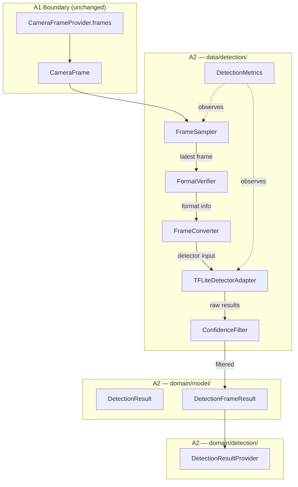
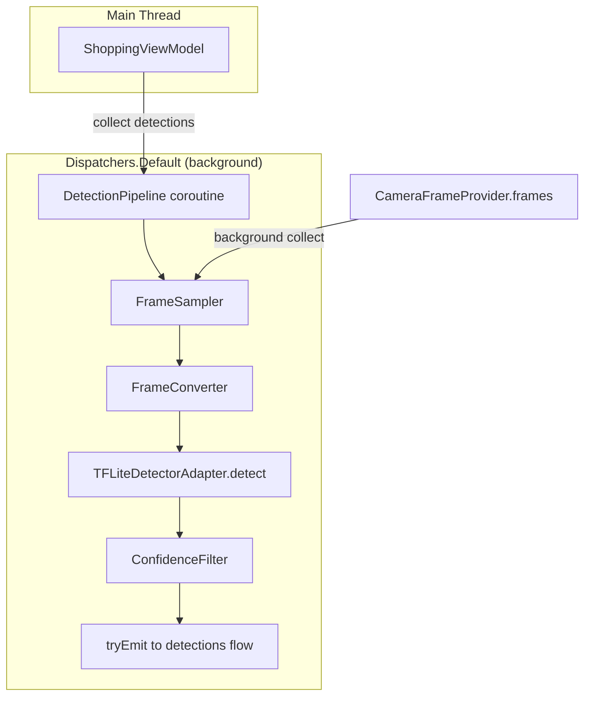
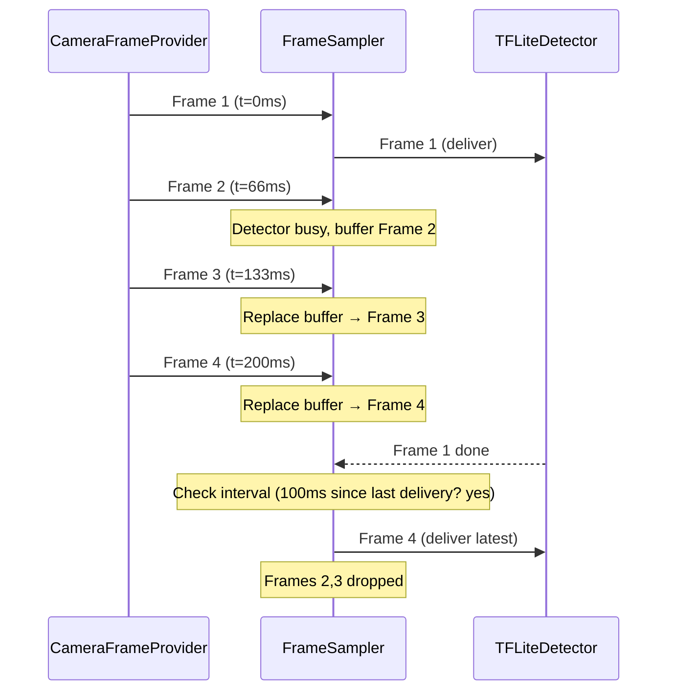
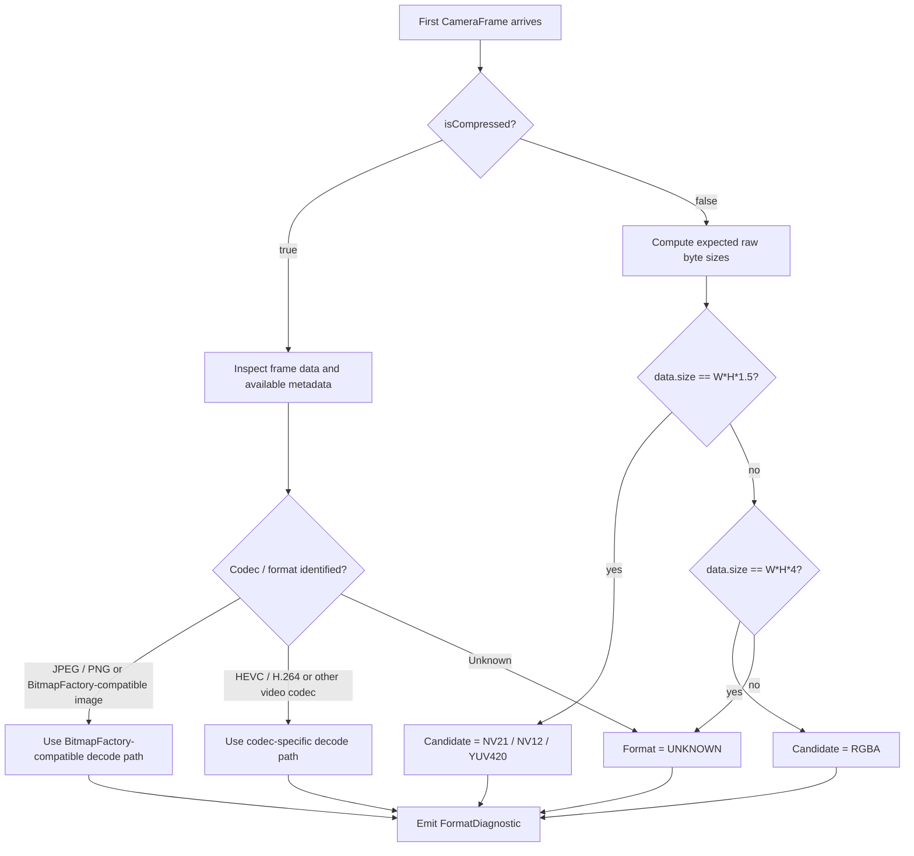
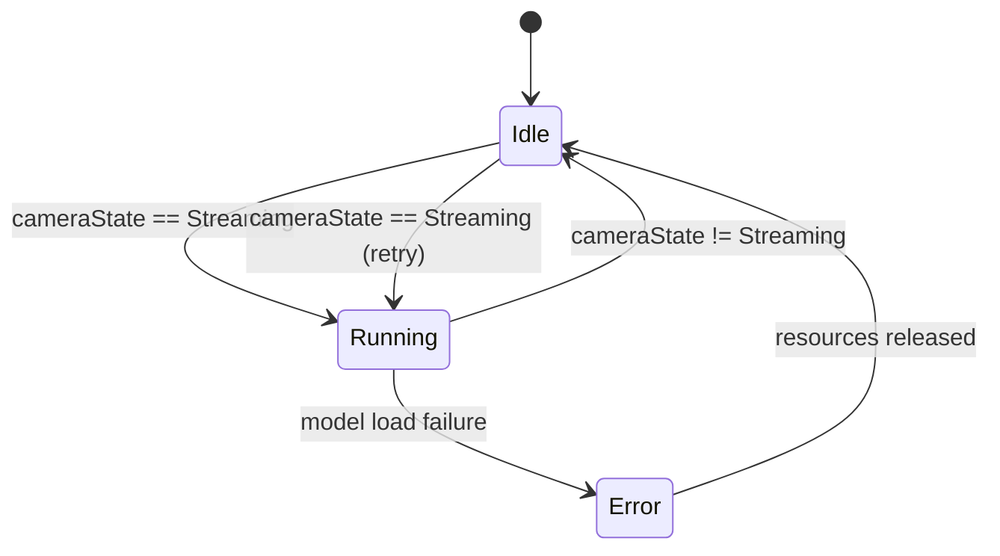

# Design Document: On-Device Object Detection (A2)

## Overview

Stage A2 introduces on-device object detection into the existing Android application. The pipeline consumes `CameraFrame` instances from the A1 camera boundary, performs frame sampling, format conversion, and ML inference, then exposes SDK-independent detection results (`DetectionFrameResult`) to downstream components.

A2 does NOT implement tracking, attention policy, candidate selection, or backend recognition. It establishes the reliable detection boundary required for A3.



### End-to-End Data Flow

```text
CameraFrameProvider.frames (Flow<CameraFrame>)
    ↓
FrameSampler (latest-frame-wins, configurable interval)
    ↓
FormatVerifier (one-time classification on first frame)
    ↓
FrameConverter (raw/compressed → ARGB_8888 Bitmap)
    ↓
TFLiteDetectorAdapter (TFLite inference, max 20 results)
    ↓
ConfidenceFilter (threshold >= 0.3)
    ↓
DetectionFrameResult (domain model)
    ↓
DetectionResultProvider.detections (Flow<DetectionFrameResult>)
```

---

## Architecture

### Technology Decisions

| Decision | Choice | Rationale |
|----------|--------|-----------|
| **ML SDK** | TensorFlow Lite (TFLite) | Fastest inference on Android for object detection. Mature GPU/NNAPI delegate support. SSD MobileNet V2 model runs <100ms on mid-range devices. No Google Play Services dependency (unlike ML Kit on-device). Single .tflite file in assets — no download step. Most stable option for a hackathon with tight timeline. |
| **Detection Model** | SSD MobileNet V2 (COCO) | Pre-trained on 80 generic object categories (bag, bottle, etc.). ~4MB model file. Well-documented input/output tensor format. |
| **Model Input** | 300x300 ARGB_8888 Bitmap | Standard SSD MobileNet V2 input. Single resize + normalize step. |
| **Frame Sampling** | Latest-frame-wins, single-slot buffer | Simplest backpressure. No frame queue buildup. Detector always processes the freshest available frame. |
| **Threading** | Dedicated `Dispatchers.Default` coroutine | Detection pipeline runs entirely off Main. Simple, no thread pool management. |
| **DI** | Existing Manual `AppContainer` | No new framework. Single lazy instantiation. |
| **Format Assumption** | NV21 (configurable, verified=false) | Most common Android camera format. Overridden once Gen2 format is empirically confirmed. |

### Dependency Direction

```text
feature/shopping/
    │
    ▼
domain/detection/
    DetectionResultProvider (interface)
domain/model/
    DetectionResult
    DetectionFrameResult
    ▲
    │
data/detection/
    TFLiteDetectorAdapter
    FrameSampler
    FrameConverter
    FormatVerifier
    DetectionPipeline (orchestrator)
```

No TFLite import escapes `data/detection/`. Domain and Presentation only see `DetectionResultProvider`, `DetectionResult`, `DetectionFrameResult`.

---

## Components and Interfaces

### New File Structure

```text
app/src/main/java/com/gryffindor/smartshopping/
├── domain/
│   ├── model/
│   │   ├── DetectionResult.kt          (NEW)
│   │   └── DetectionFrameResult.kt     (NEW)
│   └── detection/
│       └── DetectionResultProvider.kt   (NEW — interface)
│
├── data/
│   └── detection/
│       ├── DetectionPipeline.kt         (NEW — orchestrator, implements DetectionResultProvider)
│       ├── FrameSampler.kt              (NEW — latest-frame-wins sampling)
│       ├── FormatVerifier.kt            (NEW — one-time format classification)
│       ├── FrameConverter.kt            (NEW — CameraFrame bytes → Bitmap)
│       ├── TFLiteDetectorAdapter.kt     (NEW — TFLite inference wrapper)
│       └── DetectionMetrics.kt          (NEW — latency/FPS/drop logging)
│
├── core/
│   └── config/
│       └── AppConfig.kt                 (EXTENDED — detection params)
│
└── app/
    └── AppContainer.kt                  (EXTENDED — detection wiring)

app/src/main/assets/
└── ssd_mobilenet_v2.tflite              (NEW — model file)
```

### Component Responsibilities

| Component | Responsibility |
|-----------|---------------|
| `DetectionResultProvider` | Domain-layer interface exposing `Flow<DetectionFrameResult>` and pipeline state. No lifecycle methods exposed to consumers. |
| `DetectionPipeline` | Orchestrates the full pipeline: subscribes to `CameraFrameProvider.frames`, coordinates sampling → conversion → inference → filtering → emission. Owns lifecycle (start/stop tied to camera state). |
| `FrameSampler` | Implements latest-frame-wins with configurable minimum interval. Single-slot buffer. Replaces buffered frame on each new arrival. |
| `FormatVerifier` | Runs once on the first frame. Classifies byte format by comparing `data.size` against expected sizes for NV21/NV12/YUV420/RGBA. Emits structured diagnostic record. |
| `FrameConverter` | Converts `CameraFrame.data` (verified format) into a 300x300 `Bitmap` suitable for TFLite. Pools up to 3 reusable byte buffers. |
| `TFLiteDetectorAdapter` | Loads `.tflite` model, runs inference, maps TFLite output tensors to `List<DetectionResult>`. All TFLite types confined here. |
| `DetectionMetrics` | Measures end-to-end latency, inference-only duration, effective detection FPS (5s rolling window), frame drop count. Logs via Logcat in debug builds. |

---

### Interface Definitions

#### DetectionResultProvider (domain/detection/)

```kotlin
interface DetectionResultProvider {
    /** Stream of detection results. One emission per processed frame. */
    val detections: Flow<DetectionFrameResult>

    /** Current pipeline state. */
    val pipelineState: StateFlow<DetectionPipelineState>
}

sealed class DetectionPipelineState {
    data object Idle : DetectionPipelineState()
    data object Running : DetectionPipelineState()
    data class Error(val message: String) : DetectionPipelineState()
}
```

No `start()`, `stop()`, or `close()` exposed. Lifecycle is internal to `DetectionPipeline`, driven by `CameraState`.

#### DetectionPipeline (data/detection/)

```kotlin
class DetectionPipeline(
    private val cameraFrameProvider: CameraFrameProvider,
    private val appConfig: AppConfig,
    private val context: Context  // for asset loading only
) : DetectionResultProvider {

    override val detections: Flow<DetectionFrameResult>
    override val pipelineState: StateFlow<DetectionPipelineState>

    // Internal lifecycle — started/stopped by observing cameraState
    internal fun startDetection()
    internal fun stopDetection()
}
```

---

## Data Models

### DetectionResult (domain/model/)

```kotlin
data class DetectionResult(
    /** Normalized left edge [0.0, 1.0]. */
    val left: Float,
    /** Normalized top edge [0.0, 1.0]. */
    val top: Float,
    /** Normalized right edge [0.0, 1.0]. */
    val right: Float,
    /** Normalized bottom edge [0.0, 1.0]. */
    val bottom: Float,
    /** Detected object category (e.g., "handbag", "bottle"). Non-empty. */
    val label: String,
    /** Detection confidence in [0.0, 1.0]. */
    val confidence: Float
)
```

Coordinate system: (0.0, 0.0) = top-left, (1.0, 1.0) = bottom-right.

Invariants:
- `0.0 <= left <= right <= 1.0`
- `0.0 <= top <= bottom <= 1.0`
- `label.isNotEmpty()`
- `0.0 <= confidence <= 1.0`

### DetectionFrameResult (domain/model/)

```kotlin
data class DetectionFrameResult(
    /** Timestamp of the source CameraFrame in microseconds. */
    val frameTimestampUs: Long,
    /** Detected objects in this frame. May be empty. Never null. */
    val detections: List<DetectionResult>
)
```

### AppConfig Extensions (core/config/)

```kotlin
object AppConfig {
    // --- Detection Pipeline ---
    /** Minimum interval between frame deliveries to detector (ms). Range: 66–1000. */
    const val DETECTION_FRAME_INTERVAL_MS: Long = 100L  // ~10 FPS max detection rate

    /** Minimum confidence threshold for emitting detections. */
    const val DETECTION_CONFIDENCE_THRESHOLD: Float = 0.3f

    /** Maximum detections per frame. */
    const val DETECTION_MAX_PER_FRAME: Int = 20

    /** Inference timeout per frame (ms). */
    const val DETECTION_INFERENCE_TIMEOUT_MS: Long = 200L

    /** Maximum reusable conversion buffers. */
    const val DETECTION_MAX_BUFFERS: Int = 3

    // --- Format Verification ---
    /** Assumed pixel format before Gen2 verification. */
    const val DETECTION_ASSUMED_FORMAT: String = "NV21"

    /** Whether the assumed format has been verified on real Gen2. */
    const val DETECTION_FORMAT_VERIFIED: Boolean = false

    // --- Metrics ---
    /** Rolling window for FPS calculation (ms). */
    const val DETECTION_METRICS_WINDOW_MS: Long = 5000L
}
```

### FormatDiagnostic (data/detection/ internal)

```kotlin
internal data class FormatDiagnostic(
    val formatLabel: String,       // "NV21", "NV12", "RGBA", "UNKNOWN"
    val width: Int,
    val height: Int,
    val byteLength: Int,
    val bytesPerPixel: Float,
    val verified: Boolean
)
```

---

## Coroutine and Threading Structure



### Execution Model

```text
DetectionPipeline owns:
├── scope = CoroutineScope(SupervisorJob() + Dispatchers.Default)
├── detectionJob: Job? (cancelled on stop)
└── All heavy work runs in this scope

Main Thread:
├── ViewModel collects detections Flow (lightweight)
└── Never blocks on inference or conversion
```

The pipeline coroutine:

```kotlin
private fun launchDetection() {
    detectionJob = scope.launch {
        cameraFrameProvider.frames
            .conflate()  // drop intermediate if slow
            .collect { frame ->
                // FrameSampler enforces minimum interval
                if (!frameSampler.shouldProcess(frame)) return@collect

                val startTime = System.nanoTime()

                // Format verification (first frame only)
                formatVerifier.verifyIfNeeded(frame)

                // Convert
                val bitmap = frameConverter.convert(frame) ?: return@collect

                // Detect with timeout
                val rawResults = withTimeoutOrNull(AppConfig.DETECTION_INFERENCE_TIMEOUT_MS) {
                    detector.detect(bitmap)
                } ?: run {
                    metrics.recordTimeout(frame.timestampUs)
                    return@collect
                }

                // Filter by confidence
                val filtered = rawResults
                    .filter { it.confidence >= AppConfig.DETECTION_CONFIDENCE_THRESHOLD }
                    .take(AppConfig.DETECTION_MAX_PER_FRAME)

                val result = DetectionFrameResult(
                    frameTimestampUs = frame.timestampUs,
                    detections = filtered
                )

                _detections.tryEmit(result)
                metrics.recordDetection(startTime, frame.timestampUs, filtered.size)
            }
    }
}
```

---

## Backpressure Strategy

### Frame Sampling: Latest-Frame-Wins



### Implementation

```kotlin
internal class FrameSampler(
    private val minIntervalMs: Long = AppConfig.DETECTION_FRAME_INTERVAL_MS
) {
    private var lastDeliveryTimeMs: Long = 0L

    fun shouldProcess(frame: CameraFrame): Boolean {
        val now = System.currentTimeMillis()
        if (now - lastDeliveryTimeMs < minIntervalMs) {
            return false  // too soon, skip
        }
        lastDeliveryTimeMs = now
        return true
    }
}
```

Combined with `Flow.conflate()` on the upstream `frames` flow, this achieves:
- At most 1 buffered frame (Kotlin conflate semantics = latest-frame-wins)
- Configurable minimum delivery interval (default 100ms = max 10 detections/sec)
- Zero unbounded backlog

### Detection Output Backpressure

```kotlin
private val _detections = MutableSharedFlow<DetectionFrameResult>(
    replay = 0,
    extraBufferCapacity = 1,
    onBufferOverflow = BufferOverflow.DROP_OLDEST
)
```

If downstream (ViewModel) is slower than detection emission rate, the oldest unconsumed result is dropped and only the latest is available.

---

## Detector Initialization and Reuse

### TFLite Model Lifecycle

```text
Detection starts (camera → STREAMING)
    ↓
Load model from assets (one-time)
    ↓
Create Interpreter (reused across frames)
    ↓
Process frames...
    ↓
Detection stops (camera stops)
    ↓
Close Interpreter
    ↓
Release model ByteBuffer
    ↓
State → Idle
```

### TFLiteDetectorAdapter

```kotlin
internal class TFLiteDetectorAdapter(private val context: Context) {

    private var interpreter: Interpreter? = null

    fun initialize(): Boolean {
        return try {
            val model = loadModelFile("ssd_mobilenet_v2.tflite")
            val options = Interpreter.Options().apply {
                setNumThreads(4)
                // GPU delegate added if available, fallback to CPU
            }
            interpreter = Interpreter(model, options)
            true
        } catch (e: Exception) {
            false
        }
    }

    fun detect(bitmap: Bitmap): List<DetectionResult> {
        val interp = interpreter ?: return emptyList()
        // Run inference, map TFLite output tensors → DetectionResult
        // ...
    }

    fun release() {
        interpreter?.close()
        interpreter = null
    }
}
```

Key decisions:
- **Reuse Interpreter** across frames (creation is expensive ~200ms)
- **4 CPU threads** for inference parallelism
- **No GPU delegate initially** — add in optimization pass if needed
- **Lazy initialization** — model loaded only when detection starts
- **Idempotent release** — safe to call multiple times

---

## Format Verification and Conversion

### Format Verification Logic



### FrameConverter

```kotlin
internal class FrameConverter {
    private val bufferPool = ArrayDeque<ByteArray>(AppConfig.DETECTION_MAX_BUFFERS)

    fun convert(frame: CameraFrame, verifiedFormat: VerifiedFrameFormat): Bitmap? {
        return when (verifiedFormat){
            VerifiedFrameFormat.NV21, 
            VerifiedFrameFormat.NV12, 
            VerifiedFrameFormat.YUV420, 
            VerifiedFrameFormat.RGBA -> convertRaw(frame, verifiedFormat) VerifiedFrameFormat.JPEG, 
            VerifiedFrameFormat.PNG -> decodeBitmapCompatible(frame) 
            VerifiedFrameFormat.HEVC, 
            VerifiedFrameFormat.H264 -> decodeVideoCodec(frame, verifiedFormat) VerifiedFrameFormat.UNKNOWN -> null
        }
    }

    private fun convertRaw(frame: CameraFrame, format: VerifiedFrameFormat): Bitmap? {
        // Conversion implementation depends on the empirically verified 
        // Gen2 raw pixel format. 
        // 
        // Final output: 
        // source CameraFrame 
        // → ARGB_8888 Bitmap 
        // → resize to detector input size
        return null
    }

    private fun decodeCompressed(frame: CameraFrame): Bitmap? {
        // Used only when the verified frame format is compatible with 
        // BitmapFactory, such as JPEG or PNG. 
        return BitmapFactory.decodeByteArray( frame.data, 0, frame.data.size )
    }

    private fun decodeVideoCodec( 
        frame: CameraFrame, 
        format: VerifiedFrameFormat 
        ): Bitmap? { 
            // Do not assume compressed Gen2 frames are image files. 
            // 
            // If real-device verification identifies HEVC, H.264, or another 
            // video codec, use the minimum codec-specific decode path required 
            // to produce detector-compatible image data. 
            // 
            // The concrete implementation is selected only after the actual 
            // Gen2 codec has been empirically verified. 
            return null 
        }
}
```

Buffer pooling: reuse up to 3 byte arrays for intermediate conversion work, avoiding per-frame allocation.

---

## AppContainer Wiring

```kotlin
class AppContainer {
    // ... existing A0/A1 dependencies unchanged ...

    // A2: Detection Pipeline
    val detectionPipeline: DetectionPipeline by lazy {
        DetectionPipeline(
            cameraFrameProvider = cameraFrameProvider,
            appConfig = AppConfig,
            context = applicationContext
        )
    }

    val detectionResultProvider: DetectionResultProvider get() = detectionPipeline
}
```

ViewModels access only `DetectionResultProvider` (the interface). They never see `TFLiteDetectorAdapter` or any TFLite type.

---

## Detection Pipeline Lifecycle



### Lifecycle Rules

1. Pipeline observes `cameraFrameProvider.cameraState`
2. When state transitions to `Streaming` → initialize detector + start consuming frames
3. When state leaves `Streaming` → cancel detection job + release model + report Idle
4. If model fails to load → emit `DetectionPipelineState.Error` without crashing
5. If camera restarts while releasing → complete release before starting new cycle (use Mutex)

```kotlin
init {
    scope.launch {
        cameraFrameProvider.cameraState.collect { state ->
            when (state) {
                is CameraState.Streaming -> startDetection()
                else -> stopDetection()
            }
        }
    }
}
```

---

## Performance Metrics

### DetectionMetrics

```kotlin
internal class DetectionMetrics {
    private val TAG = "DetectionMetrics"

    // Rolling window state
    private var windowStartMs = 0L
    private var detectionsInWindow = 0
    private var dropsInWindow = 0

    fun recordDetection(startNanos: Long, frameTimestampUs: Long, resultCount: Int) {
        val endToEndMs = (System.nanoTime() - startNanos) / 1_000_000
        Log.d(TAG, "e2e=${endToEndMs}ms frame=$frameTimestampUs results=$resultCount")
        detectionsInWindow++
        checkWindow()
    }

    fun recordDrop(reason: String) {
        dropsInWindow++
        Log.d(TAG, "drop reason=$reason")
    }

    fun recordTimeout(frameTimestampUs: Long) {
        Log.w(TAG, "timeout frame=$frameTimestampUs")
        dropsInWindow++
    }

    private fun checkWindow() {
        val now = System.currentTimeMillis()
        if (now - windowStartMs >= AppConfig.DETECTION_METRICS_WINDOW_MS) {
            val fps = detectionsInWindow.toFloat() / ((now - windowStartMs) / 1000f)
            Log.d(TAG, "window: fps=$fps detections=$detectionsInWindow drops=$dropsInWindow")
            windowStartMs = now
            detectionsInWindow = 0
            dropsInWindow = 0
        }
    }
}
```

Metrics logged:
- End-to-end latency per frame (CameraFrame receipt → DetectionFrameResult emission)
- Inference-only duration (separate timing around `detector.detect()`)
- Effective detection FPS (rolling 5-second window)
- Frames dropped (by sampler, by timeout, by conversion failure)

All metrics use `Log.d` with `"DetectionMetrics"` tag — filterable in Logcat.

---

## Real Gen2 Acceptance Verification

### Verification Path

```text
Meta Ray-Ban Gen 2 connected
→ Camera STREAMING
→ CameraFrame emitted
→ FrameSampler selects frame
→ FormatVerifier classifies format (first frame)
→ FrameConverter produces Bitmap
→ TFLiteDetectorAdapter runs inference
→ DetectionResult(s) with bbox, label, confidence
→ DetectionFrameResult observable at domain boundary
→ Logcat shows: e2e latency, FPS, detections
→ Camera stops → detection stops → camera restarts → detection resumes
```

### What Must Be Verified on Real Gen2

1. `CameraFrame.isCompressed` actual value
2. If uncompressed: actual pixel format (NV21? NV12? RGBA?)
3. Byte length matches width * height * expected BPP
4. TFLite can consume the converted frame without crash
5. Detections are produced for visible objects
6. End-to-end latency < 300ms (conversion + inference)
7. No main-thread blocking during detection

### Mock Device Provisional Testing

Until Gen2 hardware is available:
- Use MockDevice frames from A1
- Verify pipeline mechanics (sampling, conversion path, inference, filtering, emission)
- Record provisional metrics
- MockDevice success does NOT validate the Gen2 acceptance criterion

---

## Correctness Properties

*A property is a characteristic or behavior that should hold true across all valid executions of a system — essentially, a formal statement about what the system should do. Properties serve as the bridge between human-readable specifications and machine-verifiable correctness guarantees.*

### Property 1: Format Classification Correctness

*For any* `CameraFrame` with `isCompressed = false` and known `width` and `height`, if `data.size` equals the expected byte length for exactly one candidate format (NV21: W*H*1.5, NV12: W*H*1.5, RGBA: W*H*4), the format classifier SHALL identify that format correctly.

**Validates: Requirements 1.3, 1.7**

### Property 2: Latest-Frame-Wins Delivery

*For any* sequence of N `CameraFrame` instances arriving while the detector is processing a previous frame, the next frame delivered to the Detection_Pipeline after processing completes SHALL have the highest `timestampUs` among those N frames.

**Validates: Requirements 2.3, 2.4, 2.5**

### Property 3: Frame Sampling Rate Limiting

*For any* stream of `CameraFrame` instances arriving at a rate faster than the configured minimum interval, the number of frames forwarded to the Detection_Pipeline over any time window SHALL NOT exceed `window_duration / min_interval + 1`.

**Validates: Requirements 2.2, 2.6**

### Property 4: Detection Output Validity

*For any* `DetectionResult` emitted by the pipeline, all four bounding box coordinates SHALL satisfy `0.0 <= left <= right <= 1.0` and `0.0 <= top <= bottom <= 1.0`, the `label` SHALL be non-empty, and `confidence` SHALL be in `[0.0, 1.0]`.

**Validates: Requirements 4.2, 6.1, 6.2, 6.3, 6.8**

### Property 5: Confidence Filtering Correctness

*For any* detection produced by the Object_Detector with confidence `c` and configured threshold `t`, the detection SHALL appear in the emitted `DetectionFrameResult` if and only if `c >= t`.

**Validates: Requirements 4.10, 11.1, 11.2**

### Property 6: One-to-One Frame-to-Result Mapping

*For any* `CameraFrame` that passes sampling and is successfully processed (conversion succeeds and inference completes within timeout), the pipeline SHALL emit exactly one `DetectionFrameResult` whose `frameTimestampUs` equals the source `CameraFrame.timestampUs`.

**Validates: Requirements 6.4, 7.2, 7.3**

### Property 7: Detection Count Bounded

*For any* single processed frame, the number of `DetectionResult` instances in the emitted `DetectionFrameResult.detections` SHALL NOT exceed the configured maximum (20).

**Validates: Requirements 4.4**

### Property 8: ML SDK Mapping Preservation

*For any* raw TFLite detection output with bounding box, class index, and score, the `TFLiteDetectorAdapter` SHALL map it to a `DetectionResult` where the normalized coordinates, label string (from COCO class list), and confidence score preserve the source values without loss.

**Validates: Requirements 5.4**

### Property 9: Buffer Pool Bounded

*For any* sequence of frame conversions, the `FrameConverter` SHALL never allocate more than 3 concurrent conversion buffers, regardless of processing rate.

**Validates: Requirements 3.8**

### Property 10: Detection Output Backpressure Bounded

*For any* production rate of `DetectionFrameResult` emissions, the unconsumed buffer SHALL never exceed 1 result, and a slow downstream collector SHALL always receive the most recent emission.

**Validates: Requirements 7.6**

### Property 11: Pipeline Lifecycle Tied to Camera State

*For any* sequence of `CameraState` transitions, the Detection_Pipeline SHALL emit `DetectionFrameResult` instances ONLY while `CameraState == Streaming`. No detections SHALL be emitted in any other state.

**Validates: Requirements 8.4, 7.7**

---

## Error Handling

| Scenario | Behavior |
|----------|----------|
| Model file missing from assets | `DetectionPipelineState.Error("Model not found")`. No crash. Pipeline stays idle. |
| Model load / Interpreter creation fails | Same error state. Logged. Retry on next camera STREAMING transition. |
| Frame conversion fails (corrupt data) | Frame discarded. Diagnostic logged. Pipeline continues with next frame. |
| Inference timeout (>200ms) | Frame discarded. Timeout logged. Pipeline continues. |
| CameraFrameProvider.frames throws | Detection job cancelled. Pipeline → Idle. No crash. |
| TFLite inference exception | Frame discarded. Error logged. Pipeline continues. |
| Rapid start/stop cycles | Mutex serializes lifecycle. Previous release completes before new start. |
| Unknown frame format | Frame discarded. FormatDiagnostic and frame metadata are logged. The pipeline continues with subsequent frames without crashing. No raw-format assumption is applied once real-device format verification is being performed. |

### Unknown Format Policy

NV21 may be used only as a provisional assumption before real Gen2 verification is available.

Once testing with the actual Gen2 camera begins, an unknown format SHALL NOT be interpreted as NV21 or another guessed pixel format.

Instead:

UNKNOWN format
→ discard frame
→ log diagnostic
→ keep camera pipeline alive
→ resolve actual format before implementing conversion

This prevents invalid byte interpretation from producing corrupted images, false detections, or unnecessary changes to the already validated A1 camera pipeline.

### Error State Exposure

```kotlin
sealed class DetectionPipelineState {
    data object Idle : DetectionPipelineState()
    data object Running : DetectionPipelineState()
    data class Error(val message: String) : DetectionPipelineState()
}
```

ViewModel can observe `pipelineState` to show detection status. Error state does not crash the app or block the shopping session flow.

---

## Testing Strategy

### Unit Tests

**Property-Based Tests (PBT)** — using [Kotest Property Testing](https://kotest.io/docs/proptest/property-based-testing.html):

| Property | Test |
|----------|------|
| Format Classification | Generate random width/height, compute expected byte length for each format, verify classifier correctness |
| Latest-Frame-Wins | Generate random frame sequences with timestamps, simulate busy detector, verify latest delivered |
| Rate Limiting | Generate rapid frame streams, verify forward count bounded by interval |
| Detection Output Validity | Generate random detection outputs from adapter, verify all field constraints |
| Confidence Filtering | Generate random confidences + thresholds, verify correct partition |
| Timestamp Preservation | Generate random frames, verify output timestamp matches input |
| Detection Count | Generate detection lists of varying sizes, verify capped at 20 |
| Buffer Pool | Simulate rapid conversions, verify pool size <= 3 |

Each PBT runs minimum 100 iterations.

**Example-Based Unit Tests:**

- FormatVerifier with compressed frame → logs codec inspection
- FrameConverter with NV21 data → produces valid Bitmap
- TFLiteDetectorAdapter initialization success/failure
- Pipeline error recovery (model missing → error state → camera restart → retry)
- Flow termination propagation

### Integration Tests

- Full pipeline: synthetic CameraFrame → DetectionFrameResult emission
- Start/stop cycle: 10 cycles without crash or memory leak
- Concurrent sampling: verify no race conditions

### Architecture Verification

```bash
# No TFLite imports outside data/detection/
grep -r "org.tensorflow" app/src/main/java/ --include="*.kt" | grep -v "data/detection/"

# No ML Kit imports anywhere
grep -r "com.google.mlkit" app/src/main/java/ --include="*.kt"

# CameraFrame.kt unchanged
git diff HEAD -- app/src/main/java/.../domain/model/CameraFrame.kt

# CameraFrameProvider.kt unchanged
git diff HEAD -- app/src/main/java/.../domain/camera/CameraFrameProvider.kt

# data/meta/ unchanged
git diff HEAD -- app/src/main/java/.../data/meta/

# Build succeeds
./gradlew clean assembleDebug
```

### Real Device Testing

- Verify format diagnostic on first Gen2 frame
- Measure end-to-end latency (<300ms target)
- Measure effective detection FPS (target: 5-10 FPS)
- Confirm detections for visible objects in Logcat
- Verify no ANR or main-thread block

---

## Gradle Dependencies (A2 additions)

```kotlin
dependencies {
    // TensorFlow Lite
    implementation("org.tensorflow:tensorflow-lite:2.14.0")
    implementation("org.tensorflow:tensorflow-lite-support:0.4.4")

    // Testing — Property-Based
    testImplementation("io.kotest:kotest-property:5.8.0")
    testImplementation("io.kotest:kotest-runner-junit5:5.8.0")
}
```

Model file: `app/src/main/assets/ssd_mobilenet_v2.tflite` (~4MB, downloaded from TF Hub).

---

## Requirements Traceability

| Requirement | Design Coverage |
|-------------|-----------------|
| R1 — Format Verification | FormatVerifier component, diagnostic record, configurable assumption (NV21, verified=false) |
| R2 — Frame Sampling | FrameSampler (latest-frame-wins), conflate(), configurable interval, background dispatcher |
| R3 — Format Conversion | FrameConverter (NV21→Bitmap, compressed decode), buffer pool (max 3), background thread |
| R4 — Object Detection | TFLiteDetectorAdapter, SSD MobileNet V2, on-device only, max 20 results, 200ms timeout |
| R5 — ML SDK Isolation | All TFLite confined to `data/detection/`, only domain types cross boundary |
| R6 — DetectionResult Contract | domain/model/DetectionResult + DetectionFrameResult, normalized coords, no ML SDK refs |
| R7 — Detection Output | DetectionResultProvider.detections Flow, one emission per frame, DROP_OLDEST backpressure |
| R8 — Pipeline Lifecycle | Tied to CameraState.Streaming, Mutex-protected start/stop, 10-cycle stability |
| R9 — Performance Metrics | DetectionMetrics: latency, FPS, drops, inference duration, Logcat logging |
| R10 — Architecture Preservation | Zero changes to CameraFrame, CameraFrameProvider, data/meta/; AppContainer extension only |
| R11 — Confidence Filtering | Filter inside data/detection/, threshold from AppConfig (0.3), configurable |
