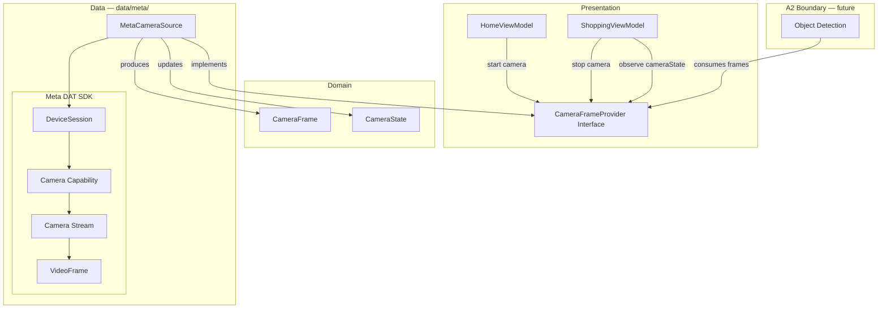

# Design Document: Meta DAT Camera Input (A1)

## Overview

Stage A1 integrates the Meta Device Access Toolkit camera pipeline into the existing A0 Android application.

The adapter converts SDK-owned `VideoFrame` instances into app-owned `CameraFrame` objects and exposes them through an SDK-independent boundary that A2 Object Detection can consume.

A1 reuses the camera lifecycle and frame-access patterns already validated during Stage 0. It does not reimplement or revalidate the entire Stage 0 experiment.



### Data Flow

```text
Meta DAT VideoFrame
(SDK-owned buffer)
        ↓
minimum safe ByteArray copy
inside VideoFrame collection scope
        ↓
CameraFrame
(app-owned memory)
        ↓
bounded SharedFlow
DROP_OLDEST
        ↓
CameraFrameProvider.frames
        ↓
A2 Object Detection
(future)
```

### Dependency Direction

```text
feature/
   │
   ▼
domain/
  CameraFrameProvider
  CameraFrame
  CameraState
   ▲
   │
data/meta/
  MetaCameraSource
```

Meta DAT SDK types remain inside `data/meta/`.

Domain, ViewModel, Presentation, and future A2 components depend only on SDK-independent application contracts.

---

## Architecture

## Technology Decisions

| Decision                | Choice                                                                         | Rationale                                                           |
| ----------------------- | ------------------------------------------------------------------------------ | ------------------------------------------------------------------- |
| DAT SDK version         | Meta Wearables DAT 0.9.0 Developer Preview                                     | Already validated during Stage 0                                    |
| DAT dependency setup    | Reuse the dependency repository/configuration from the working Stage 0 project | Avoid inventing an unverified repository URL or configuration       |
| PAT management          | Environment variable or `local.properties`                                     | Matches Stage 0 setup; credentials remain outside Git               |
| Frame payload ownership | Immediate `ByteBuffer → ByteArray` copy                                        | Prevents SDK-managed frame memory from escaping its valid lifetime  |
| Frame delivery          | `MutableSharedFlow` with one extra buffer slot and `DROP_OLDEST`               | Keeps frame backlog bounded and favors recent frames                |
| State exposure          | `StateFlow<CameraState>`                                                       | Exposes one current SDK-independent camera state                    |
| Adapter execution       | Adapter-owned coroutine scope using a background dispatcher                    | DAT lifecycle and frame work must not block the Android main thread |
| Lifecycle serialization | Start/stop operations serialized inside `MetaCameraSource`                     | Prevents overlapping lifecycle operations and cleanup races         |
| DI                      | Existing Manual `AppContainer`                                                 | Preserves A0 architecture                                           |
| Mock Device dependency  | Debug build only                                                               | Keeps Mock Device code outside release builds                       |

---

## DAT Build Configuration

A1 SHALL reuse the exact DAT repository and dependency configuration that successfully resolved the Stage 0 CameraAccess project.

The source-of-truth documentation records the following requirements:

* Meta Wearables DAT `0.9.0`
* `mwdat-core`
* `mwdat-camera`
* debug-only `mwdat-mockdevice`
* GitHub classic PAT with `read:packages`
* PAT provided through an environment variable or `local.properties`
* PAT never committed to Git

The literal Maven repository URL and property names SHALL be copied from the already-working Stage 0 project rather than reconstructed or guessed from this design document.

Conceptually:

```kotlin
dependencies {
    // Existing A0 dependencies remain unchanged.

    implementation("...:mwdat-core:0.9.0")
    implementation("...:mwdat-camera:0.9.0")
    debugImplementation("...:mwdat-mockdevice:0.9.0")
}
```

Actual coordinates and repository configuration SHALL use the values already proven to resolve in Stage 0.

---

## Components and Interfaces

## New A1 Components

The existing recommended project structure is retained.

```text
app/src/main/java/.../
├── domain/
│   ├── model/
│   │   ├── CameraFrame.kt
│   │   └── CameraState.kt
│   └── camera/
│       └── CameraFrameProvider.kt
│
├── data/
│   └── meta/
│       └── MetaCameraSource.kt
│
└── existing files modified as needed
    ├── app/AppContainer.kt
    ├── feature/home/HomeViewModel.kt
    └── feature/shopping/ShoppingViewModel.kt
```

Exact file placement may follow the existing repository structure, but the architectural boundary is fixed:

```text
Meta DAT SDK
→ data/meta only
```

---

## Data Models

### CameraFrame

`CameraFrame` is the application-owned representation of a DAT camera frame.

Stage 0 verified access to:

```text
buffer
width
height
presentationTimeUs
isCompressed
```

A1 preserves only the verified information required for the next processing stage.

Conceptually:

```kotlin
data class CameraFrame(
    val data: ByteArray,
    val width: Int,
    val height: Int,
    val timestampUs: Long,
    val isCompressed: Boolean
)
```

## Ownership Rules

`CameraFrame.data` is always owned by the App.

It MUST NOT contain or retain:

```text
VideoFrame
SDK-owned ByteBuffer
DAT enum
DAT annotation
DAT session/camera object
```

The `ByteArray` remains valid independently after the original `VideoFrame` callback or collection iteration completes.

## Format Handling

A1 does not infer a more specific pixel or codec format than Stage 0 proves.

Stage 0 confirmed that:

* compressed/uncompressed status is accessible
* compressed Mock Device frames were observed
* frame representation may differ depending on downstream requirements

Therefore A1 preserves `isCompressed` and raw app-owned bytes.

A1 does not assume that every uncompressed frame is a particular YUV layout such as NV12.

Any concrete decode or conversion required by A2 shall be selected from actual DAT frame characteristics and Object Detection input requirements.

---

# CameraState

The SDK-independent state model is:

```kotlin
sealed class CameraState {
    data object NotConnected : CameraState()
    data object Connecting : CameraState()
    data object Ready : CameraState()
    data object Streaming : CameraState()

    data class RecoverableError(
        val message: String
    ) : CameraState()

    data class BlockingError(
        val message: String
    ) : CameraState()
}
```

No Meta SDK exception or enum is exposed directly through the public state API.

### State Meaning

| State              | Meaning                                                      |
| ------------------ | ------------------------------------------------------------ |
| `NotConnected`     | No active camera pipeline                                    |
| `Connecting`       | DeviceSession/camera setup is in progress                    |
| `Ready`            | DeviceSession and camera capability are ready                |
| `Streaming`        | Camera stream is active and producing frames                 |
| `RecoverableError` | Current camera pipeline failed but a fresh start may recover |
| `BlockingError`    | User/device intervention is required before retry            |

The exact mapping of DAT failures into recoverable/blocking categories shall use errors that can actually be distinguished through the DAT API.

Unrecognized failures default to a safe error state rather than inventing unsupported classifications.

---

# CameraFrameProvider

The SDK-independent camera boundary is:

```kotlin
interface CameraFrameProvider {

    val frames: Flow<CameraFrame>

    val cameraState: StateFlow<CameraState>

    suspend fun startCamera()

    suspend fun stopCamera()
}
```

A2 will consume:

```text
CameraFrameProvider.frames
        ↓
CameraFrame
        ↓
Object Detection
```

A2 therefore has no dependency on Meta DAT.

No consumer registry, dynamic observer manager, or additional camera abstraction is required for A1.

---

# MetaCameraSource

`MetaCameraSource` is the sole owner of the Meta DAT camera integration.

Responsibilities:

* create `DeviceSession`
* start `DeviceSession`
* acquire camera capability
* start Camera Stream
* collect `VideoFrame`
* transfer frame bytes into App-owned memory
* emit `CameraFrame`
* expose CameraState
* stop Camera Stream
* release camera capability
* stop DeviceSession
* clear active DAT resource references
* support a fresh start after stop

Conceptual structure:

```kotlin
class MetaCameraSource : CameraFrameProvider {

    private val _cameraState =
        MutableStateFlow<CameraState>(CameraState.NotConnected)

    override val cameraState: StateFlow<CameraState> =
        _cameraState.asStateFlow()

    private val _frames =
        MutableSharedFlow<CameraFrame>(
            replay = 0,
            extraBufferCapacity = 1,
            onBufferOverflow = BufferOverflow.DROP_OLDEST
        )

    override val frames: Flow<CameraFrame> =
        _frames.asSharedFlow()

    private val scope =
        CoroutineScope(SupervisorJob() + Dispatchers.Default)

    private val lifecycleMutex = Mutex()

    private var streamingJob: Job? = null

    // Actual DAT types remain private inside data/meta.
    private var activeSession: /* DAT DeviceSession */ Any? = null
    private var activeCamera: /* DAT Camera capability */ Any? = null

    override suspend fun startCamera() {
        lifecycleMutex.withLock {
            if (streamingJob?.isActive == true) {
                return
            }

            cleanupExistingResourcesIfNeeded()

            _cameraState.value = CameraState.Connecting

            streamingJob = scope.launch {
                runCameraPipeline()
            }
        }
    }

    override suspend fun stopCamera() {
        lifecycleMutex.withLock {
            val job = streamingJob
            streamingJob = null

            job?.cancelAndJoin()

            withContext(Dispatchers.Default) {
                cleanupResourcesInOrder()
            }

            _cameraState.value = CameraState.NotConnected
        }
    }
}
```

The `Any` placeholders above are documentation-only. Actual implementation uses the real DAT types privately inside `data/meta`.

---

# DAT Pipeline

The actual DAT API calls SHALL be copied from the Stage 0 implementation that already succeeded.

Conceptually:

```kotlin
private suspend fun runCameraPipeline() {
    try {
        val session = createDeviceSessionFromValidatedStage0Code()
        activeSession = session

        session.start()

        val camera = acquireCameraUsingValidatedStage0Code(session)
        activeCamera = camera

        _cameraState.value = CameraState.Ready

        startCameraStream(camera)

        _cameraState.value = CameraState.Streaming

        collectVideoFrames(camera) { videoFrame ->

            // Minimum work required while SDK-owned frame is valid.
            val source = videoFrame.buffer
            val bytes = ByteArray(source.remaining())
            source.get(bytes)

            val frame = CameraFrame(
                data = bytes,
                width = videoFrame.width,
                height = videoFrame.height,
                timestampUs = videoFrame.presentationTimeUs,
                isCompressed = videoFrame.isCompressed
            )

            _frames.tryEmit(frame)
        }

    } catch (e: CancellationException) {
        throw e

    } catch (e: Exception) {
        _cameraState.value = mapCameraError(e)

    } finally {
        // Ordered cleanup executes from the adapter-owned lifecycle.
        cleanupResourcesInOrder()
    }
}
```

Exact DAT method names are intentionally not duplicated or guessed here.

Implementation SHALL reuse the methods proven by Stage 0, including the validated conceptual flow:

```text
Wearables.createSession()
→ session.start()
→ session.addCamera()
→ camera.stream.start()
→ camera.stream.videoStream.collect()
```

---

# Resource Ownership and Cleanup

The first design version kept `session` and `camera` only as local variables inside the streaming job. That would make external stop cleanup unreliable.

A1 instead gives `MetaCameraSource` explicit ownership of the currently active DAT resources.

Conceptually:

```text
MetaCameraSource
├── active DeviceSession
├── active camera capability
└── streaming Job
```

All references remain private to `data/meta`.

## Ordered Shutdown

The intended lifecycle is:

```text
Shopping End
        ↓
cancel frame collection
        ↓
Camera Stream STOP
        ↓
camera capability release/remove
        ↓
DeviceSession STOP
        ↓
clear active references
        ↓
CameraState.NotConnected
```

This follows the lifecycle already validated during Stage 0.

Cleanup SHALL be idempotent enough that:

* normal user stop
* stream failure
* cancellation
* partial startup failure

can all reach a safe terminal state without application crash.

An individual cleanup failure SHALL not prevent the adapter from attempting the remaining cleanup operations where possible.

## Start After Stop

A stopped `DeviceSession` is not reused.

```text
START
→ Session A
→ STOP
→ Session A discarded

START
→ new Session B
```

This matches the lifecycle behavior validated in Stage 0.

---

# Threading

## Execution Model

`viewModelScope.launch` normally begins on the Android Main dispatcher.

Therefore the design does **not** rely on a ViewModel call being off-main.

Instead:

```text
ViewModel
   │
   │ lightweight suspend call
   ▼
MetaCameraSource
   │
   ▼
adapter-owned background context
   ├── DAT startup
   ├── frame collection
   ├── frame memory copy
   └── DAT teardown
```

Potentially blocking DAT operations and frame processing SHALL not execute directly on the Android main thread.

## VideoFrame Collection

Inside the DAT frame collection scope:

```text
VideoFrame received
        ↓
read metadata
        ↓
copy SDK ByteBuffer → ByteArray
        ↓
construct CameraFrame
        ↓
tryEmit
        ↓
return immediately
```

The minimum memory ownership transfer occurs before the SDK-managed frame can become invalid.

The callback/collect block SHALL NOT perform:

* Object Detection
* image recognition
* Backend networking
* expensive image conversion
* attention calculation
* Product Card updates

Those operations belong downstream.

---

# Backpressure

Camera production may be faster than A2 Object Detection.

The A1 frame boundary therefore uses:

```kotlin
MutableSharedFlow<CameraFrame>(
    replay = 0,
    extraBufferCapacity = 1,
    onBufferOverflow = BufferOverflow.DROP_OLDEST
)
```

## Behavior

With an active slow consumer:

```text
Frame 1
Frame 2
Frame 3
Frame 4
```

The pipeline does not build an unbounded queue.

Older pending frames may be discarded so processing remains close to the current camera view.

This matches the shopping workload, where stale frames are less valuable than recent frames.

`replay = 0` also means a newly attached collector does not receive an old historical frame automatically.

When there is no collector, A1 does not retain an accumulating camera-frame history.

The exact number of frames processed by A2 may later be reduced further through A2 throttling if detection throughput requires it.

---

# Shopping Session Integration

A1 connects the existing shopping flow to camera lifecycle operations with minimal changes.

## Start Flow

```text
Home
↓
startShopping()
↓
create existing shopping session
↓
request camera start
↓
navigate / expose active Shopping state
```

Camera availability is **not** a prerequisite for creating or entering the shopping session.

If camera startup fails:

```text
Shopping Session
→ remains usable

CameraState
→ error
```

The existing fake-data application flow remains operational.

Conceptually:

```kotlin
fun startShopping() {
    viewModelScope.launch {
        _uiState.update {
            it.copy(
                isStarting = true,
                errorMessage = null
            )
        }

        try {
            val session =
                sessionRepository.createSession("CNY")

            _uiState.update {
                it.copy(
                    sessionId = session.sessionId,
                    isSessionActive = true,
                    isStarting = false
                )
            }

            // Camera lifecycle is additive.
            // Camera failure is represented through CameraState
            // and does not invalidate the shopping session.
            cameraFrameProvider.startCamera()

        } catch (e: Exception) {
            _uiState.update {
                it.copy(
                    isStarting = false,
                    errorMessage = e.message ?: "Error"
                )
            }
        }
    }
}
```

Implementation may separate the camera call from the session try/catch if needed to ensure a camera failure never rolls back an otherwise valid shopping session.

---

# Shopping End Integration

Shopping completion must not depend on successful camera teardown.

Required behavior:

```text
End Shopping
├── request camera stop
└── complete shopping session
        ↓
continue existing Review flow
```

If camera cleanup fails, the existing shopping session completion/navigation must still proceed.

Conceptually:

```kotlin
fun endShopping(sessionId: String) {
    viewModelScope.launch {

        runCatching {
            cameraFrameProvider.stopCamera()
        }

        sessionRepository.completeSession(sessionId)

        // Existing navigation/result flow continues.
    }
}
```

Camera errors remain observable through `CameraState`, but they do not block the user's application flow.

---

# ShoppingViewModel Camera State

If Presentation requires camera feedback, the Shopping ViewModel may expose the existing SDK-independent state additively:

```kotlin
val cameraState: StateFlow<CameraState> =
    cameraFrameProvider.cameraState
```

The ViewModel does not import or interpret DAT types.

No camera-specific rewrite of the existing Shopping state architecture is required for A1.

---

# Manual DI Integration

The existing Manual DI strategy remains unchanged.

Conceptually:

```kotlin
class AppContainer {

    // Existing A0 dependencies remain unchanged.

    val cameraFrameProvider: CameraFrameProvider by lazy {
        MetaCameraSource()
    }
}
```

Only the SDK-independent interface is injected into feature-layer ViewModels.

```text
AppContainer
      ↓
CameraFrameProvider
      ↓
HomeViewModel / ShoppingViewModel

runtime implementation:
MetaCameraSource
```

No Hilt or other DI framework is introduced.

---

# Meta SDK Boundary

Allowed:

```text
data/meta/MetaCameraSource
    ↓
Meta DAT types
```

Prohibited:

```text
HomeViewModel → VideoFrame
ShoppingViewModel → DeviceSession
Domain → DAT Camera
ObjectDetector → Meta ByteBuffer
Compose Screen → Meta SDK
```

A boundary check SHALL verify no Meta DAT imports escape `data/meta/`, excluding any explicitly allowed debug-only Meta source-set code under the same Meta adapter boundary.

---

## Error Handling

A1 uses a minimal error strategy appropriate for the hackathon.

## Recoverable Errors

Examples may include failures where a completely fresh camera startup can reasonably be attempted again.

```text
CameraState.RecoverableError
→ user/system may call startCamera again
→ new DeviceSession
```

## Blocking Errors

Used only when DAT provides enough information to determine that retrying without external intervention is inappropriate.

Examples can include:

* unsupported device
* required permission unavailable

The implementation SHALL NOT invent detailed error classifications that the DAT API cannot actually distinguish.

Unknown failures may be represented as a generic recoverable or blocking error according to the safest behavior available from the validated SDK API.

## Partial Startup Failure

Example:

```text
DeviceSession created
→ camera acquisition fails
```

Result:

```text
error state
→ release any acquired resources
→ stop/discard DeviceSession
→ future start creates a new DeviceSession
```

## Stream Failure

```text
STREAMING
→ stream exception
→ CameraState error
→ cleanup
→ new start allowed when recoverable
```

No exponential backoff, persistent retry worker, or background reconnect architecture is added in A1.

---

# A0 Functionality Preservation

The following A0 behavior remains unchanged:

```text
Home
→ Shopping
→ Review
→ Travel
→ Checklist
→ Recommendation
```

Existing fake repositories remain available.

Existing fake Product Card rendering remains available.

A Meta wearable being unavailable must not prevent the rest of the fake application flow from operating.

A1 does not redesign:

* backend DTOs
* repository contracts unrelated to camera input
* navigation architecture
* Review
* Travel
* Checklist
* Recommendation

---

## Correctness Properties

These invariants describe behaviors that normal unit/integration tests should verify.

No new property-testing framework is introduced.

### Property 1: Frame Ownership Independence

After a `VideoFrame` is converted into a `CameraFrame`, invalidating or changing the original SDK-managed memory must not affect `CameraFrame.data`.

**Validates: Requirements 5.1, 5.2, 6.1, 6.2**

### Property 2: Metadata Preservation

For each converted frame:

```text
CameraFrame.width
    == VideoFrame.width

CameraFrame.height
    == VideoFrame.height

CameraFrame.timestampUs
    == VideoFrame.presentationTimeUs

CameraFrame.isCompressed
    == VideoFrame.isCompressed
```

**Validates: Requirements 5.2, 5.3, 5.4, 5.5**

### Property 3: Bounded Delivery

A slow consumer must not create an indefinitely growing frame queue.

**Validates: Requirements 6.2, 6.3**

### Property 4: Fresh Session After Stop

```text
start
→ Session A

stop
→ Session A disposed

start
→ Session B
```

Session A is never reused after being stopped.

**Validates: Requirements 2.3, 3.4**

### Property 5: Camera Failure Isolation

A DAT camera failure must not crash the application or prevent the existing shopping session flow from completing.

**Validates: Requirements 2.4, 3.5, 8.4**

---

## Testing Strategy

A1 uses the existing project test stack and simple architecture/smoke checks.

No Kotest or new property-based testing dependency is introduced solely for A1.

## Unit Tests

### CameraFrame Conversion

Verify:

* copied frame bytes equal source content at conversion time
* source memory mutation does not change `CameraFrame.data`
* width preserved
* height preserved
* timestamp preserved
* compressed status preserved

### CameraState

Verify the expected SDK-independent logical states exist and state transitions emitted by the adapter are coherent.

### Lifecycle

Using the smallest practical fake/test seam around Meta lifecycle behavior, verify:

```text
start
→ Streaming

stop
→ NotConnected

start
→ Streaming
```

and confirm a fresh session is created after stop.

### Cleanup

Verify the adapter attempts cleanup in the intended lifecycle order:

```text
stop stream
→ release camera capability
→ stop session
→ clear resources
```

where observable through the available test seam.

### Backpressure

A slow collector test SHALL confirm rapid frame production does not create an unbounded pending frame history.

### Failure Isolation

Verify camera start/stop failures do not prevent the existing shopping session lifecycle from completing.

---

# Architecture Checks

Verify no DAT SDK import exists outside the allowed Meta integration boundary.

Conceptually:

```text
feature/        → no DAT imports
domain/         → no DAT imports
presentation/   → no DAT imports
data/meta/      → DAT imports allowed
```

---

# Build and Regression Verification

Required:

```bash
./gradlew clean assembleDebug
```

Existing application smoke verification:

```text
Home
→ Shopping
→ Review
→ Travel
→ Checklist
→ Recommendation
```

Also verify:

* fake Product Card still renders
* normal Android back stack still works
* application launches without a Meta device
* camera failure does not crash the application

---

# Mock Device Smoke Test

Reuse the Stage 0 Mock Device flow.

Target path:

```text
Mock Device
→ DAT
→ current Android App
→ DeviceSession
→ Camera Stream
→ VideoFrame
→ CameraFrame
→ CameraFrameProvider.frames
```

Verify:

* DeviceSession starts
* Camera Stream starts
* VideoFrame continues arriving
* CameraFrame is produced
* dimensions/timestamp are observed
* stop succeeds
* fresh start succeeds
* CameraFrame reception resumes

This is the main A1 development acceptance path before real Gen2 hardware verification.

---

# Real Device Acceptance

The hardware acceptance path remains:

```text
Meta Ray-Ban Gen 2
→ DAT
→ current Android App
→ CameraFrame observed at A2 boundary
```

If actual Gen2 hardware is unavailable during A1 implementation:

```text
Mock Device integration
→ PASS

Actual Gen2
→ PENDING
```

Mock success must not be reported as real Gen2 success.

The current adapter boundary is designed so that a real Gen2 should not require an architectural redesign, but actual device behavior remains unverified until the hardware test is performed.

---

# Requirements Traceability

| Requirement                               | Design Coverage                                                                            |
| ----------------------------------------- | ------------------------------------------------------------------------------------------ |
| R1 — DAT Dependency Integration           | Reuse Stage 0 dependency/repository configuration; PAT outside Git; debug-only Mock Device |
| R2 — DeviceSession Lifecycle              | MetaCameraSource owns active session; fresh session after stop                             |
| R3 — Camera Stream Lifecycle              | Explicit startup, frame collection, ordered shutdown, restart                              |
| R4 — Meta SDK Type Isolation              | DAT usage confined to `data/meta`; SDK-independent public contracts                        |
| R5 — CameraFrame Contract                 | App-owned ByteArray + width + height + timestampUs + isCompressed                          |
| R6 — Ownership / Threading / Backpressure | Immediate safe copy, background adapter work, bounded SharedFlow                           |
| R7 — Camera State                         | SDK-independent StateFlow with required logical states                                     |
| R8 — Shopping Session Integration         | Start/stop connected additively; camera failure does not block existing flow               |
| R9 — A2 Boundary                          | `CameraFrameProvider.frames: Flow<CameraFrame>`                                            |
| R10 — Architecture Preservation           | Existing layers, Manual DI, Fake repositories, navigation and Product Card retained        |

---

# Out of Scope

A1 does not design or implement:

* Object Detection
* Object Tracking
* bounding boxes
* Center ROI
* Occupancy
* Dwell
* Attention Trigger
* candidate selection
* recognition crop generation
* Backend `/recognize`
* OpenAI
* product ID resolution
* real Product Card data integration
* threshold calibration
* Eye Tracking
* Hand Tracking
* full camera stream upload
* WebSocket camera transport
* SSE camera transport
* foreground/background streaming architecture
* Wake Lock architecture
* 15-minute stress behavior as an A1 blocking requirement
* analytics/telemetry infrastructure
* production-grade automatic reconnect infrastructure

The next-stage boundary remains:

```text
CameraFrame
→ Object Detection
→ Center / Occupancy / Dwell
→ Trigger
```

A1 ends after reliable `CameraFrame` delivery.
